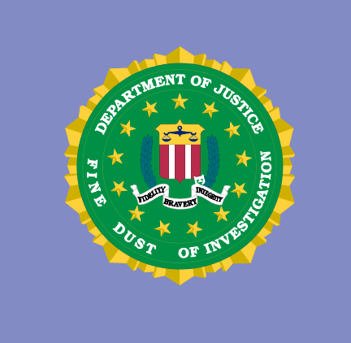

# 2019 미세먼지 해커톤 장려상 수상작
* won the 5th prize(PM Hackathon)
* Host: Seoul - Capital of Korea(Republic of.)
* Sponsor: SIT - Seoul Institute of Technology - National Organization of Korea(Republic of.)
# Team-FDI_DustPrescription

 
🌟Mobile Application Using Android Studio for PM Hackaton🌟
 

## Members
* KimMinJi
* KimYooBin
* AhnSeonYoung
* LeeHyeJin
* ChoHyoungSeo

## Building Role 1 
* PM: ChoHyoungSeo

* PLAN: KimMinJi, KimYooBin, AhnSeonYoung, LeeHyeJin, ChoHyoungSeo

* Design: KimMinJi, KimYooBin, AhnSeonYoung, LeeHyeJin, ChoHyoungSeo

* FRONT-END: KimMinJi, AhnSeonYoung, LeeHyeJin

* BACK-END: KimYooBin, ChoHyoungSeo

## Building Role 2
* PROTOTYPING: KimMinJi, AhnSeonYoung

* DEVELOP: KimYooBin, ChoHyoungSeo, LeeHyeJin

## Final 본선진출
June 26th~27th, 2019
MayField Hotel

* Prototyping, Design, Front-end, Back-end: KimMinJi, KimYooBin, AhnSeonYoung, LeeHyeJin, ChoHyoungSeo

* Display representative: 
* sub-Display representative: 

* Presentation representative:

## DustPrescription 
An application that shows public/private recognition of Fine Dust, encourages people who involved in using this App to do some actions and realize how hazardous it is.

## The motivation behind the creation/maintenance of this project
The motivation of this application is to enlighten the danger of Fine Dust and realize how ignorant we were. Also this application is going to inform user what he/she should do to minimize harm and prevent occursion of Fine Dust.
Furthermore, we can encourage people who don't use this app therefore this app is going to make a "Web/Network" between people which means all the people will become more aware of Fine Dust at final.
**why** the project exists: 
 
Nowadays people are ignorant of Fine Dust. This can change citizens recognition about Fine Dust and more aware of it. 
Therefore we can be further away from diseases that occured by dust.
Finally, we will solve the fundamental cause of Fine Dust.

## Build status

## Code style

 
## Tech/framework used
<b>Built with</b>
- [AndroidStudio](https://developer.android.com/studio/install?hl=ko)

## Screenshots
logo, screenshots 

## API Reference
atmosphere pollution

## License 
GNU General Public License (GPLv3)
 
GNU 3.0 © [Team-FDI](https://github.com/ChoHyoungSeo/Team-FDI_DustDescription)
